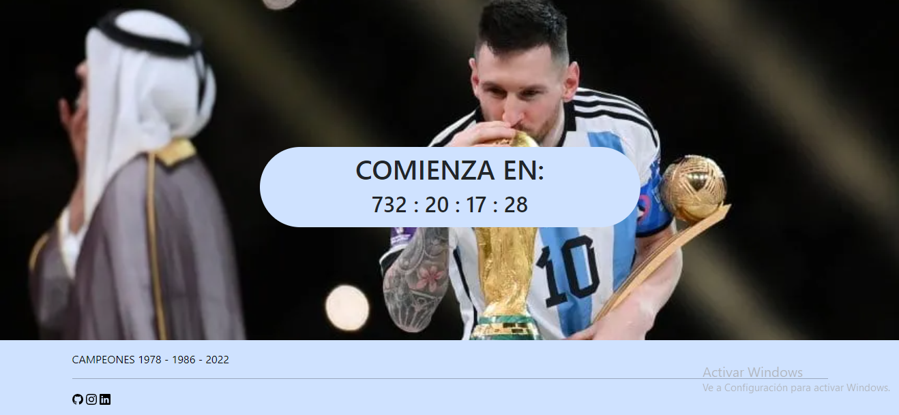

# CONTADOR MUNDIAL

Un pequeño proyecto utilizando un framework de Python llamado Flask el cual consiste de una cuenta regresiva para el mundial de fútbol 2026.

## Capturas
Proximamente con el avance del subiré capturas del proyecto.

## Instalación

1. Clonar el repositorio 
2. Activar un entorno virtual 
3. Ejecutar el comando "pip install -r .\requirements.txt" que instalará las versiones de las modulos requeridos.
4. Proximamente

    
## Contribución

Cualquier contribución es bien recibida, unicamente seguir los pasos de instalación y enviar un pull request.
(No a la principal)

